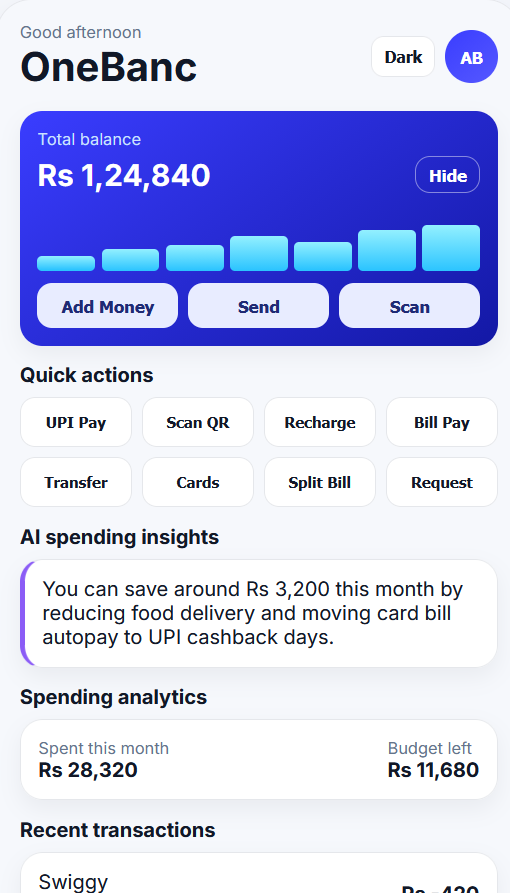
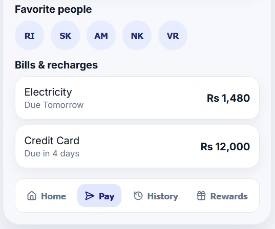
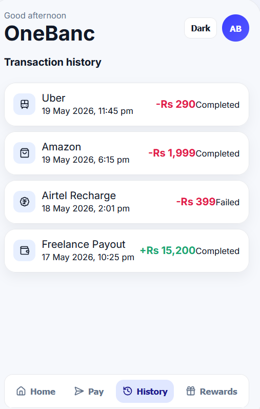

# OneBanc Redesign (React + Backend)

Modern 3-screen fintech redesign prototype for OneBanc, inspired by apps like GPay, Paytm, and Instacred.

## Features

- React frontend with:
  - `Home` screen
  - `Pay` screen
  - `Rewards` screen
- Bottom navigation with icons
- Swipe between tabs
- Dark mode toggle with persistence (`localStorage`)
- Express backend serving dashboard data
- Frontend-backend integration via Vite proxy

## Tech Stack

- Frontend: React, Vite, lucide-react
- Backend: Node.js, Express, CORS

## Project Structure

```text
ONEBANC/
  backend/
    server.js
  src/
    components/
    screens/
    App.jsx
    main.jsx
    styles.css
  index.html
  package.json
  vite.config.js
```

## Installation

```bash
npm install
```

## Run Locally

Open two terminals in the project root.

### 1) Start backend

```bash
npm run server
```

Backend runs on: `http://localhost:4000`

### 2) Start frontend

```bash
npm run dev
```

Frontend runs on: `http://localhost:5173`

## Live Demo

- Frontend: https://onebanc-assignment-frontend.onrender.com
- Backend: https://onebanc-assignment-backend-qpzw.onrender.com

## Screenshots

### Login


### Verify OTP


### Home Dashboard



### Pay Screen


### Transaction History



### Rewards Screen



## Build

```bash
npm run build
```

## API Endpoints

- `GET /api/health` - backend health check
- `GET /api/dashboard` - dashboard payload for Home/Pay/Rewards screens

## Notes

- Frontend requests `/api/*` are proxied to backend through `vite.config.js`.

## Deployment

Below are concise, practical options to deploy both the frontend (Vite) and the backend (Node/Express). Pick the provider that best fits your workflow.

**Frontend (Vite)**:
- **Netlify (recommended quick deploy)**:
  - Build: `npm run build`
  - Deploy: drag `dist` folder to Netlify UI or use Netlify CLI:
    ```bash
    npm install -g netlify-cli
    netlify deploy --prod --dir=dist
    ```
- **Vercel**:
  - Install Vercel CLI and run `vercel` in project root; it auto-detects Vite.
    ```bash
    npm i -g vercel
    vercel --prod
    ```
- **GitHub Pages (static)**:
  - Build then push `dist` to `gh-pages` branch (use `gh-pages` package or CI).
    ```bash
    npm run build
    npx gh-pages -d dist
    ```
- **Docker (static serve)**:
  - Simple Nginx container that serves `dist`.
    ```bash
    npm run build
    docker build -t onebanc-frontend .
    docker run -p 80:80 onebanc-frontend
    ```

**Backend (Node / Express)**:
- Ensure `PORT` and any secrets are provided as env vars.
- **Render / Railway / Fly / Heroku** (platform-as-a-service):
  - Push repo, create a new service, set build/start commands.
  - Example Procfile for Heroku: `web: node backend/server.js`
- **PM2 (self-host / VPS)**:
  - Install PM2 and start the server for production:
    ```bash
    cd backend
    npm install
    PM2_HOME=~/.pm2 pm2 start server.js --name onebanc-backend
    pm2 save
    ```
- **Docker (recommended for consistent deploys)**:
  - Example `Dockerfile` (backend):
    ```dockerfile
    FROM node:18-alpine
    WORKDIR /app
    COPY backend/package*.json ./
    RUN npm ci --only=production
    COPY backend/ .
    ENV PORT=4000
    EXPOSE 4000
    CMD ["node","server.js"]
    ```
  - Build & run:
    ```bash
    docker build -t onebanc-backend .
    docker run -p 4000:4000 -e PORT=4000 onebanc-backend
    ```

**CORS & Proxy**:
- If frontend and backend are on different origins, set proper CORS in `backend/server.js` and update any production API base URLs.

**Quick checklist before deploy**:
- Set `NODE_ENV=production` for backend.
- Confirm `vite.config.js` base path if deploying to a subpath.
- Add required env vars to the hosting provider (API keys, DB URLs).
- Test build locally: `npm run build` then serve `dist` locally (`npx serve dist`).

